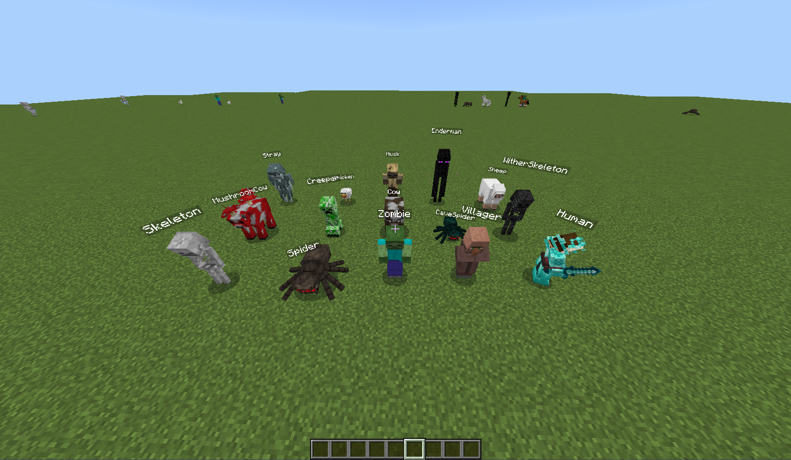

# Slapper for PowerNukkitX



**Slapper** is a high-performance NPC (Non-Player Character) plugin specifically optimized for [PowerNukkitX](https://github.com/PowerNukkitX/PowerNukkitX). It allows server administrators to create stationary, persistent entities that execute one or multiple commands when interacted with or attacked by players.

---

## Features

* **Optimized for PowerNukkitX:** Leverages modern PNX entity registries and NBT handling for maximum stability.
* **Diverse Entity Support:** Support for a wide range of entities including Humans, Mob types, and even objects like Primed TNT or Minecarts.
* **Deep Human Customization:** Full persistence for skins (including Persona and Geometry), armor, inventory, and off-hand items.
* **Command Automation:** Attach multiple commands to a single entity with console-level execution.
* **Dynamic Placeholders:** Use `{player}` in commands to dynamically target the player interacting with the NPC.
* **Remote Command Authority (RCA):** Includes a utility to force players to execute commands via `/rca`.
* **Robust Persistence:** Custom `SlapperLoaderEntity` logic ensures NPCs are correctly restored after chunk reloads or server restarts.
* **Developer API:** Comprehensive custom events for integration with other PNX plugins.

---

## Installation

1.  Download [Slapper.jar](https://github.com/mdafftfa/Slapper/releases/download/slapperv1.0.0/Slapper.jar).
2.  Place the file into your PowerNukkitX `plugins/` folder.
3.  Restart your server.
4.  Done.

---

## Commands & Permissions

### Slapper Commands
| Command | Description | Permission | Default |
| :--- | :--- | :--- | :--- |
| `/slapper spawn <type> [name]` | Spawns a new NPC at your location. | `slapper.command.spawn` | OP |
| `/slapper edit <id> <addcom\|delcom>`| Adds or removes a command from an NPC. | `slapper.command.edit` | OP |
| `/slapper id` | Find an NPC's ID by hitting/slapping it. | `slapper.command.id` | OP |
| `/slapper remove` | Enter removal mode to delete an NPC. | `slapper.command.remove` | OP |
| `/slapper list` | Displays a list of all active Slapper entities. | `slapper.command.list` | OP |

### Utility Commands
| Command | Description | Permission | Default |
| :--- | :--- | :--- | :--- |
| `/rca <player> <command>` | Force a player to execute a command. | `rca.command` | OP |

---

## Usage Examples

### 1. Creating a Server Navigator
To create a Human NPC that opens a menu or teleports a player:
1.  **Spawn:** `/slapper spawn human §6§lNavigator`
2.  **Identify:** Run `/slapper id` and hit the NPC. (Let's say the ID is `500`).
3.  **Add Command:** `/slapper edit 500 addcommand rca {player} warp lobby`

### 2. Managing NPCs
* To see all spawned slappers: `/slapper list`
* To delete an NPC: Run `/slapper remove` then hit the target NPC. You will see: `[Slapper] Entity removed!`.

---

## Developer API (PowerNukkitX)

You can listen to Slapper events by registering a listener in your PNX plugin:

* **`SlapperCreationEvent`**: Called when an NPC is created.
* **`SlapperHitEvent`**: Called when a player interacts with an NPC (Cancellable).
* **`SlapperDeletionEvent`**: Called when an NPC is removed (Cancellable).

### Example Listener:
```java
@EventHandler
public void onSlapperHit(SlapperHitEvent event) {
    Player player = event.getExecutor();
    if (player != null) {
        player.sendMessage("You interacted with a Slapper NPC!");
    }
}
```

# Contributing
Contributions are welcome! If you'd like to improve Slapper, please follow these steps:

1. **Fork the repository.**
2. **Create a Feature Branch** `git checkout -b feature/AmazingFeature`
3. **Commit your changes** `git commit -m 'Add some AmazingFeature'`
4. **Push to the branch** `git push origin feature/AmazingFeature`
5. **Open a Pull Request.**

Please ensure your code follows the existing style, maintains compatibility with the PowerNukkitX API, and includes comments for complex logic.